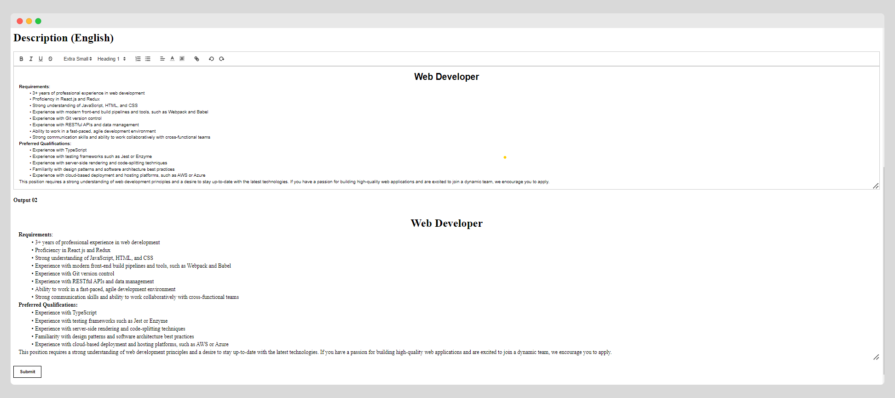
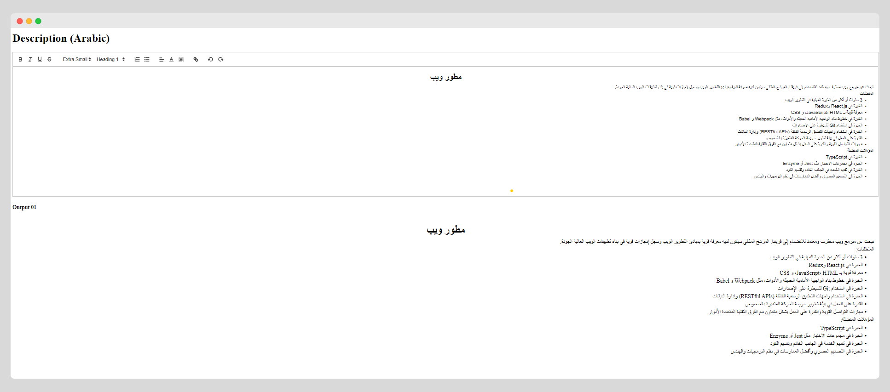

# Quill-React.js-RichText-Editor

Rich Text Editor for your next blog application, quill editor setup with react.js.

Welcome to my Rich Text Editor repository!

This project is a rich text editor built using the Quill rich text editor library and React.js. It allows users to easily create and edit rich text documents with a variety of formatting options, including bold, italic, underline, font size, font color, and more.

The editor includes features such as image upload and insert, video embed, and code block formatting. It also includes the ability to save and load documents, making it easy to work on multiple projects at once.

In addition, this project includes two examples of using the editor with right-to-left (RTL) and left-to-right (LTR) language support. This makes it suitable for use in a variety of international contexts.

I built this project with React.js to take advantage of its powerful component-based architecture and reusable code. I hope you find this project useful and I welcome any feedback or suggestions for improvement. Thank you for checking out my repository!

# LTR Sample Image

# RTL Sample Image

